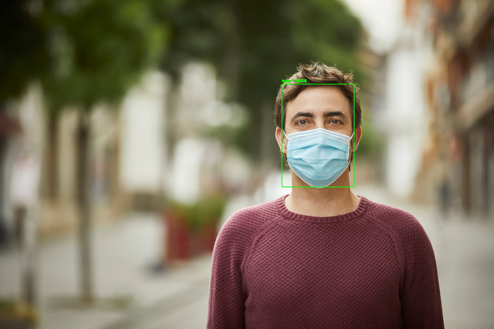

# Face Mask detection
### Introduction:
- Face mask detection had seen significant progress in the domains of Image processing and Computer vision, since the rise of the Covid-19 pandemic. Many face detection models have been created using several algorithms and techniques.  The approach in this project uses deep learning, pytorch, numPy, and matplotlib to detect face masks and calculate the accuracy of this model.
- Convolutional Neural Network, Data augmentation are the key to this project.

# Face-mask-detection-pytorch
PyTorch is an excellent deep learning framework with thousands of inbuilt functionalities that makes it a child’s play to create / train/test various models.

### Flowchart


### Dependencies:
- opendatasets
- os
- torch
- torchvision
- numPy
- matplotlib

### Dataset Used:
We'll use the COVID Face Mask Detection Dataset dataset from [Kaggle](https://www.kaggle.com/prithwirajmitra/covid-face-mask-detection-dataset). This dataset contains about 1006 equally distributed images of 2 distinct types, namely `Mask` and `Non-Mask`.

# Face-mask-detection-using-cnn
Convolutional Neural Networks (CNNs) have been demonstrated as an effective class of models for understanding image content, giving state-of-the-art results on image and video recognition,  segmentation,  detection, and retrieval. 

In our problem statement, we are dealing with images. We need to use the [**Convolutional Neural Network (CNN)**](https://en.wikipedia.org/wiki/Convolutional_neural_network) to train the image classification model. CNN contains many convolutional layers and many kernels for each layer. Values of these kernels changes to get the best possible prediction.

### Methodology used:

#### This is the step-by-step methodology of how this project is created..!!
### Example:


# Face Mask Detection Using VGG16 Architecture
## Introduction
[VGG16 Architecture](https://neurohive.io/en/popular-networks/vgg16/) is a winner of the 2014 Imagenet competition which means it is already trained on thousands of images and it has a good set of kernels. So, that's why we are going to use the VGG16 architecture to train our model with a good set kernel. Using weights of other pre-trained models for training new models on the new dataset is the concept of **Transfer Learning**.

The VGG16 Architecture model achieves 92.7% top-5 test accuracy in ImageNet, which is a dataset of over 14 million images belonging to 1000 classes. ## VGG16 architecture


Due to this Covid-19 pandemic, the masks became lifesavers. Nowadays, in most places, masks are compulsory. So, we can take the compulsion as a problem statement for our **computer vision** project.

In this problem statement, we are trying to classify the images of the person in two classes **with a mask** and **without a mask**. So, to solve this classification problem we will use **Supervised Machine Learning** techniques.
## Dataset
For the supervised machine learning problem, we will require labeled good quality data and here kaggle comes into the picture. [Kaggle](https://kaggle.com) is a platform where Data Scientists play with the various datasets and provide some good quality datasets.

# Face Mask Detection Using `facex-library`
The `FaceX` finally has it's own `face mask detection` algorithm which anybody can use by writing only one line of code. It can support both images and videos at the same time.

For more information about the all new `facex-library`, checkout this [link]([Face-X/facex-library at master · akshitagupta15june/Face-X (github.com)](https://github.com/akshitagupta15june/Face-X/tree/master/facex-library)).

Join this [discussion](https://github.com/akshitagupta15june/Face-X/discussions/323) for any queries or changes.

### Inference on image

```
import facex

image = facex.face_mask('your-image.jpg')
cv2.imshow("face_mask", cv2.resize(image, (600,600)))
cv2.waitKey()
```




### Inference on video

```
facex.face_mask('your-video.mp4')
```

